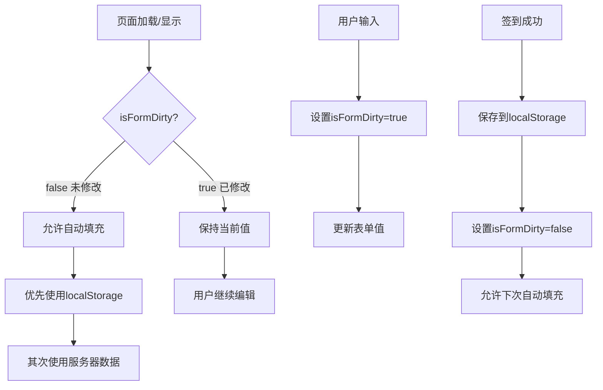
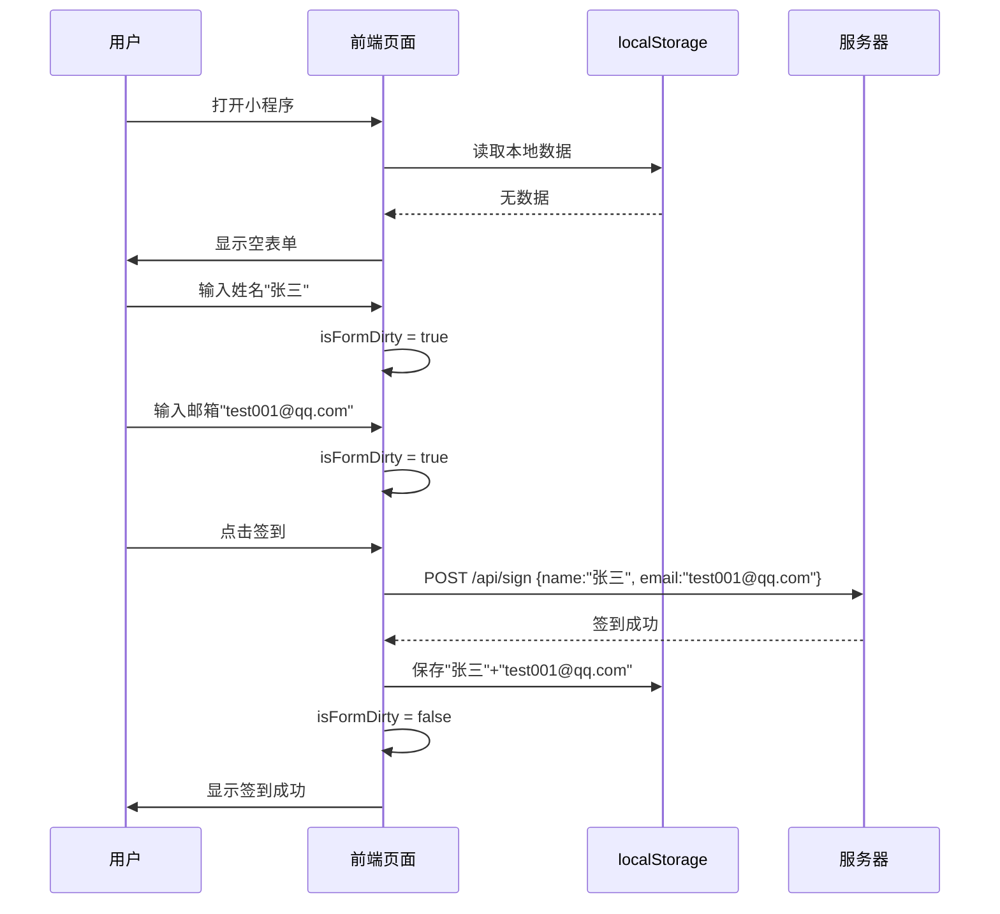
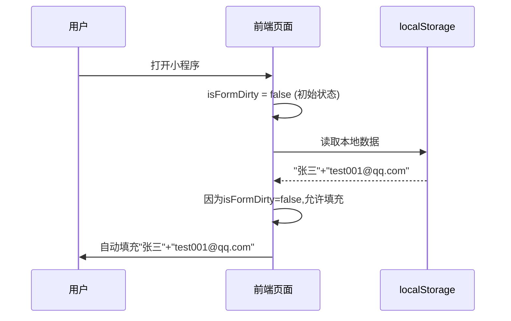
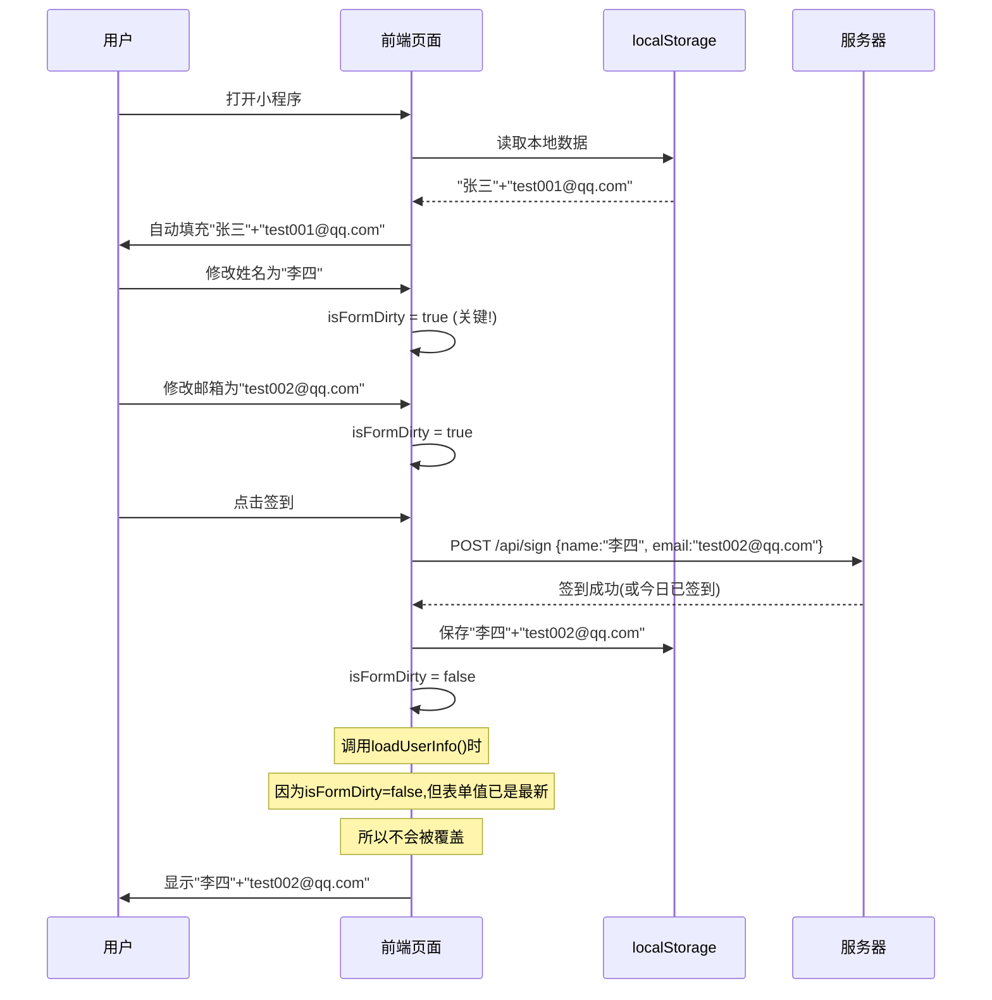
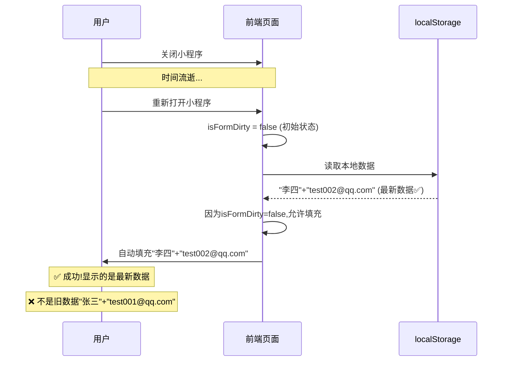
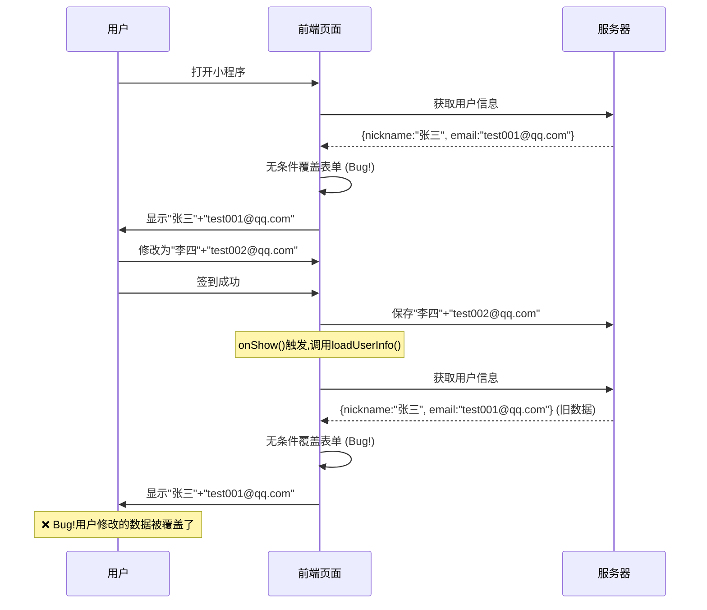

# 姓名邮箱覆盖问题 - 修复逻辑流程图

## 整体流程



## 详细场景流程

### 场景1: 首次使用



### 场景2: 第二次打开(未修改)



### 场景3: 修改信息后签到(核心修复)



### 场景4: 第三次打开(验证持久化)



## 问题修复前的流程(有Bug)



## 核心修复点

| 修复点 | 修复前 | 修复后 |
|--------|--------|--------|
| **表单状态** | 无状态跟踪 | 使用 `isFormDirty` 标记 |
| **自动填充** | 无条件覆盖 | 仅在 `isFormDirty=false` 时填充 |
| **数据优先级** | 服务器数据 | localStorage > 服务器数据 |
| **用户输入保护** | ❌ 无保护 | ✅ 输入时标记为已修改 |
| **签到后处理** | ❌ 可能被覆盖 | ✅ 清除标记但保持当前值 |

## 关键代码逻辑

### 输入时标记

```javascript
onNameInput(e) {
    this.formData.name = e.detail.value;
    this.isFormDirty = true;  // 🔑 关键:标记为已修改
    this.updateCanSign();
}
```

### 自动填充时检查

```javascript
loadUserInfo() {
    const storeUserInfo = store.getUserInfo();
    if (storeUserInfo) {
        this.userInfo = storeUserInfo;
        // 🔑 关键:只在未修改时才填充
        if (!this.isFormDirty) {
            const savedName = uni.getStorageSync('userName');
            const savedEmail = uni.getStorageSync('userEmail');
            this.formData.name = savedName || storeUserInfo.nickname || '';
            this.formData.email = savedEmail || storeUserInfo.email || '';
        }
        return;
    }
}
```

### 签到成功后清除标记

```javascript
doSignIn(openid) {
    signIn({ name, email, openid }).then(res => {
        this.saveUserInfo();
        // ... 更新全局状态
        
        // 🔑 关键:清除标记,允许下次自动填充
        // 但保持当前表单内容不变
        this.isFormDirty = false;
        
        this.loading = false;
    });
}
```

## 测试验证点

✅ **测试点1**: 用户修改后,表单不会被覆盖  
✅ **测试点2**: 关闭重开,显示最新数据  
✅ **测试点3**: localStorage优先于服务器数据  
✅ **测试点4**: 签到成功后,表单保持用户输入的值  

---

**备注**: 此流程图使用 Mermaid 语法,可以在支持 Mermaid 的 Markdown 编辑器中查看(如 Typora、VS Code等)。
